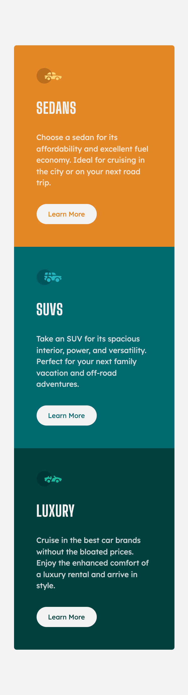
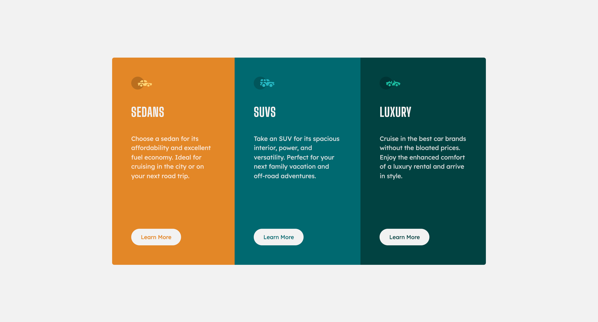

# Frontend Mentor - 3-column preview card component solution

This is a solution to the [3-column preview card component challenge on Frontend Mentor](https://www.frontendmentor.io/challenges/3column-preview-card-component-pH92eAR2-). Frontend Mentor challenges help you improve your coding skills by building realistic projects. 

## Table of contents

- [Frontend Mentor - 3-column preview card component solution](#frontend-mentor---3-column-preview-card-component-solution)
  - [Table of contents](#table-of-contents)
  - [Overview](#overview)
    - [The challenge](#the-challenge)
    - [Screenshot](#screenshot)
    - [Links](#links)
  - [My process](#my-process)
    - [Built with](#built-with)
    - [What I learned](#what-i-learned)
  - [Author](#author)
  - [Acknowledgments](#acknowledgments)

## Overview

### The challenge
- Responsive design
- Flex-direction

### Screenshot

<strong>Mobile View</strong>

<strong>Desktop View</strong>

<strong>Active State</strong>

### Links

- Solution URL: [3-column preview card component using HTML and CSS (Sass))](https://www.frontendmentor.io/solutions/3column-preview-card-component-using-html-and-css-sass-YrYoBRU_Xy)
- Live Site URL: [Frontend Mentor | 3-column preview card component](https://vangmanawkairung.github.io/Frontend-Mentor_3-column-preview-card-component/)

## My process

### Built with

- Semantic HTML5 markup
- CSS custom properties
- Flexbox
- CSS Grid
- Sass/Scss

### What I learned

- The border radius for the element with backgound-image has to re-assign

## Author

- Frontend Mentor - [@VangmanawKairung](https://www.frontendmentor.io/profile/VangmanawKairung)
- GitHub - [VangmanawKairung](https://github.com/VangmanawKairung)

## Acknowledgments

I appreciate to Frontend Mentor Team for spending the time to make this challenge.
