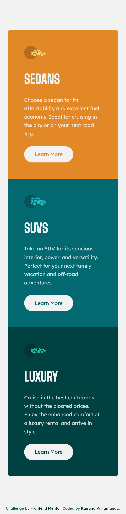
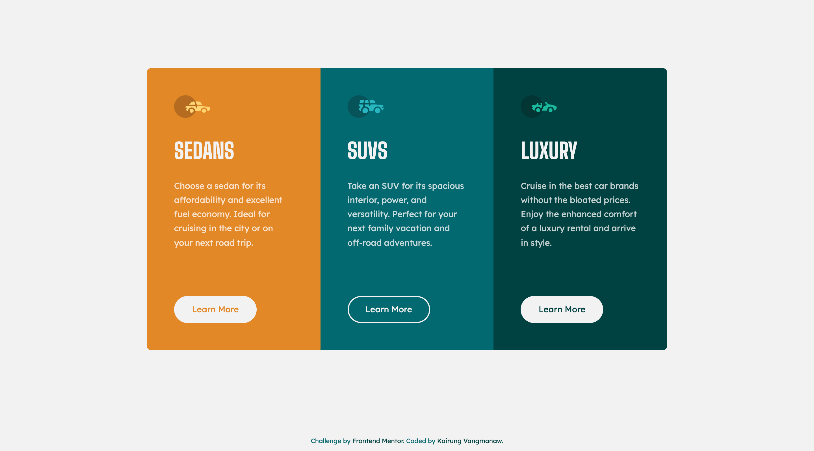
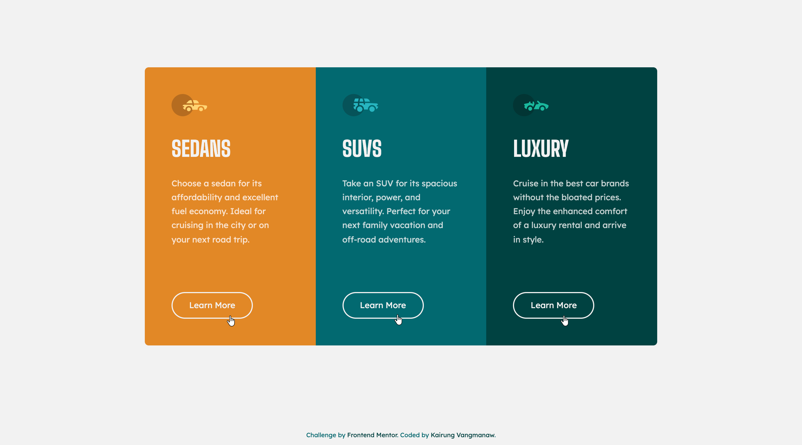

# Frontend Mentor - 3-column preview card component solution

This is a solution to the [3-column preview card component challenge on Frontend Mentor](https://www.frontendmentor.io/challenges/3column-preview-card-component-pH92eAR2-). Frontend Mentor challenges help you improve your coding skills by building realistic projects. 

## Table of contents

- [Frontend Mentor - 3-column preview card component solution](#frontend-mentor---3-column-preview-card-component-solution)
  - [Table of contents](#table-of-contents)
  - [Overview](#overview)
    - [The challenge](#the-challenge)
    - [Screenshot](#screenshot)
    - [Links](#links)
  - [My process](#my-process)
    - [Built with](#built-with)
    - [What I learned](#what-i-learned)
    - [Continued development](#continued-development)
    - [Useful resources](#useful-resources)
    - [AI Collaboration](#ai-collaboration)
  - [Author](#author)
  - [Acknowledgments](#acknowledgments)

## Overview

### The challenge

Users should be able to:

- View the optimal layout depending on their device's screen size
- See hover states for interactive elements

### Screenshot

  
Mobile view

  

  
Desktop view

  

  
Active state view

  

### Links

- Solution URL: [3-column preview card built with React, BEM & Modern CSS](https://www.frontendmentor.io/solutions/3-column-preview-card-component-using-html-and-css-sass-NSAer57MI3)
- Live Site URL: [Frontend Mentor | 3-column preview card component](https://challenged-by-frontend-mentor.github.io/3-column-preview-card-component/)

## My process

### Built with

- Semantic HTML5 markup
- CSS custom properties (Variables)
- Flexbox & CSS Grid
- Mobile-first workflow
- Modern Native CSS (including CSS Nesting)
- [React](https://reactjs.org/) - JS Library
- [Vite](https://vitejs.dev/) - Frontend Tooling

### What I learned

Working through this challenge helped me refine several practical skills in frontend development, accessibility, and CSS architecture:

- **Accessibility (a11y) Best Practices**: I learned how to handle repetitive interactive elements gracefully. Instead of ambiguous link descriptions, I used `aria-label` dynamically (`aria-label={`Learn more about ${title}`}`) to provide explicit context for screen reader users. I also practiced using `aria-hidden="true"` for decorative SVGs.

- **BEM Naming Methodology & Clean Architecture**: I deepened my understanding of BEM by structuring components into clean Blocks, Elements, and Modifiers (e.g., using `.card--orange` for theme-based state variants). I also ensured semantic consistency by replacing element-selector styling with flat class names (like `.footer__link`).

- **Advanced Layout & Sticky Footer Patterns**: I gained a deeper understanding of vertical centering and dynamic viewports. By combining `#root` with `min-height: 100dvh` and applying `margin-top: auto` / `margin-bottom: auto` to `.cards-grid` and `.footer`, I resolved desktop layout collapse issues and ensured a true sticky footer across all screen sizes.

- **Dynamic Component Mapping in React**: I improved how I handle structured data props by mapping items dynamically while maintaining strictly unique `key` props and clean data structures.

### Continued development

Moving forward, I plan to focus on:

- **Mathematical UI Calculations**: Further exploring relationships like calculated inner vs. outer border-radius formulas to build pixel-perfect UI designs seamlessly.

- **Fluid Typography and Spacing**: Experimenting with modern CSS functions like `clamp()`, `min()`, and `max()` to create smooth scaling without relying solely on traditional fixed media query breakpoints.

- **Advanced State & Interactive Polish**: Refining keyboard navigation focus indicators (`:focus-visible`), custom CSS transitions, and micro-interactions for interactive buttons.

### Useful resources

- [How to adjust the element's inner border radius](https://nikitahl.com/adjust-element-inner-border-radius/) - This article introduced me to the mathematical relationship between inner and outer border radius. Even though I ended up not needing `content-box` for this layout, understanding how outer radius minus padding equals inner radius was an eye-opening concept that replaced pure guessing.

### AI Collaboration

- **Tools Used**: Gemini and Google Search AI Mode.

- **Workflow & Insights**: I utilized AI as a Senior Developer reviewer to audit my codebase for global accessibility standards (a11y), BEM semantic correctness, and layout architecture. It helped me identify edge-case layout issues—such as understanding why vertical `margin: auto` requires an explicit height context on the parent flex container—and refine my code to be production-ready without reliance on unnecessary libraries.

## Author

- GitHub: [Kairung Vangmanaw](https://github.com/VangmanawKairung)
- Frontend Mentor - [@VangmanawKairung](https://www.frontendmentor.io/profile/VangmanawKairung)

## Acknowledgments

I would like to express my gratitude to **Frontend Mentor** for providing this engaging challenge. 

A big thanks to **Visual Studio Code** for being an essential workspace tool, and to **Preview on macOS**—which proved surprisingly effective for quick pixel measurement and visual inspection alongside my design overlay, allowing me to pinpoint dimensions efficiently without needing heavy design tools. I am also thankful for **Chrome DevTools** for precise responsive layout testing and debugging.